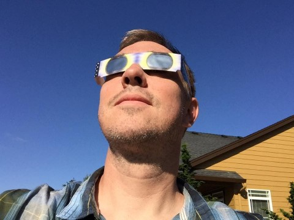

# LongReach

## About me

I'm a software developer living in the Boston area. I have a computer engineering degree and over twenty years of professional software development experience, but have been programming since I was in elementary school, starting with BASIC and moving on to 8-bit/16-bit assembly language.

Most of my background is in development of games and military simulations (which aren't too far from games), but I've also done some web development work. More recently, I've written software for stock and options trading, as well as for analyzing trade opportunities or collecting metrics on past trades.

Over my career, I've worked on:
* Video and computer games
* Military simulations
* Robotics
* Software for stock trading and analysis of buying/selling opportunities, including helping launch a hedge fund
* Web development

I'm not looking for employment right now, but this profile served me well last time I was, at the end of 2020.

## Specialties

**Strongest languages**: C++, Python (NumPy, pandas, matplotlib, etc.)  
**Also experienced in** (less recently or less experience): Javascript (Node.js, Typescript), Lua, Java, Actionscript, C, PHP, Perl, HTML  
**General skills**: game development, game AI, UI, simulation, networked systems, multi-threaded applications, databases, spreadsheet generation, writing (both documentation and writing in general), financial data analysis, machine learning basics  
**Other specialties**: Qt, SQL, Node.js, REST, Git, Mercurial (Hg), SVN, Jira, JSON  

I don't necessarily have experience with the buzziest new tools, platforms, and frameworks that everyone's hiring for at any given moment, but I can always pick those up quickly. Just about anything is more user friendly than a macro and template filled multi-hundred-thousand line, computation-intensive C++ codebase, and I've worked in those.

## Non-SW Dev Interests

Ones of Note:
* Very experienced writer
* Drones, both military and recreational
* Video editing
* Cooking!

## Public Repositories Here

  

**JavaScript(/TypeScript)**
* A [small game](https://github.com/LongReach/programming-challenge) I wrote

**Python**
* An implementation of a [linked list](https://github.com/LongReach/linked-list) class, with a robust testing framework
* A dynamic programming solution to a [scheduling problem](https://github.com/LongReach/meeting-problem)
* Two solutions to a [word ladder](https://github.com/LongReach/word-ladder) problem, both involving a connected graph

**C++**
* A C++ solution to [Einstein's Puzzle](https://github.com/LongReach/einstein-puzzle). I also added a feature to generate new puzzles automatically, which uses a gradient-descent process.
* In-progress: a project demonstrating Python-C++ integration

