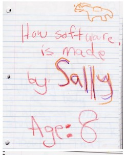

# LongReach

## About me

_(Updated May, 2025)_

I'm a software developer living in the Boston area, currently looking for new employment opportunities (I'll update this section when that changes). I have a bachelor's degree in computer engineering and over twenty years of professional software development experience. I've been coding since I was nine years old and, to use the old cliché, have forgotten many more programming languages than most people ever learn.

Over my career, I've worked on (from most to least recent):
* Software for analysis of stock/options market
* Warehouse robotics
* Military simulations (game-like environments)
* Games (console and computer)

I first created this page and most of the public repositories here in 2020, to aid me in a job search. New ones are in progress in 2025.

### Other interests

* Reading. Favorite authors: Paolo Bacigalupi, Jorge Luis Borges, Angela Carter, Ted Chiang, Philip K. Dick, Lev Grossman, Caitlin Kiernan, Stephen King, Ursula Le Guin, Stanislaw Lem, Cixin Liu, George R.R. Martin, Cormac McCarthy, China Mieville, David Mitchell, Haruki Murakami, Christopher Priest, Arthur Philips, Richard Powers, George Saunders, Dan Simmons, Neal Stephenson, Adrian Tchaikovsky, Vernor Vinge, Kurt Vonnegut, Gene Wolfe, Herman Wouk  
* History
* Biking
* Drone Photography and Video Editing
* Hiking
* Stock/Options Trading
* Cooking

## Skills

### Languages

2020 to 2025
* Python
* C++/C
* Pine (used for stock market analysis)

Pre-2025
* Javascript (Node.js, Typescript)
* Lua
* Actionscript
* PHP
* Perl
* HTML
* Java
* Assembler

### Technologies

**Most recent**: Kubernetes, MongoDB, Kakfka, ChatGPT, Elastic/Kibana, k9s, GRPC, TCP/IP, REST, YAML, JSON, PyTorch, Git, Jira, Machine Learning Basics, Excel (including generation of), PyTest, pandas, Zoom, Slack   
**Less recent**: Qt, SQL, Node.js, Mercurial (Hg), SVN

### General Skills

* Asynchronous programming (particularly `async` in Python)
* Software development for containerized environment
* Network communication
* Game development
* Game AI
* Simulation
* UI
* Backend development
* Stock market analysis
* English (skilled, highly practiced writer, very strong believer in high-quality technical documentation)

## Public Repositories Here

  

**JavaScript(/TypeScript)**

2017
* A [small game](https://github.com/LongReach/programming-challenge) I wrote

**Python**

2020
* An implementation of a [linked list](https://github.com/LongReach/linked-list) class, with a robust testing framework
* A dynamic programming solution to a [scheduling problem](https://github.com/LongReach/meeting-problem)
* Two solutions to a [word ladder](https://github.com/LongReach/word-ladder) problem, both involving a connected graph
* Some fun with [Wordle](https://github.com/LongReach/wordle), a popular game from January, 2022

2025
* A program for generating and solving [Sudoku puzzles](https://github.com/LongReach/sudoku)

**C++**

2020
* A C++ solution to [Einstein's Puzzle](https://github.com/LongReach/einstein-puzzle). I also added a feature to generate new puzzles automatically, which uses a gradient-descent process.
* A solution to a [rideshare routing problem](https://github.com/LongReach/rideshare-problem). Some prototyping with Python.
* In-progress: a project demonstrating Python-C++ integration

