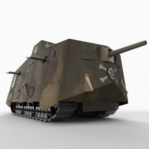

This is an early tank, used in World War I. Like most of the other tanks from that conflict, it has a steampunky design that I find visually interesting. You probably recognize the more famous British Mark IV tank, whose wraparound treads enabled it to cross trenches and cratered battlefields. None of these designs really lasted into future conflicts. They were slow, underpowered, breakdown-prone, had a high profile that made them easy targets, and were susceptible to light artillery and soldiers armed with explosive charges.

However, this tank, used by France and the USA, prototyped the basic modern shape that used in later years, right up to the present day.

I've always been interested in military history, particularly in various kinds of machines. In this case, I just liked the job the artist did with the model and decided to toss it on my Github page. Then I decided to add this explanation and a few more images. I sometimes use World War I vehicles as a metaphor for the current state of machine learning; i.e. starting to show their potential, but we haven't seen its full power unleashed yet.
